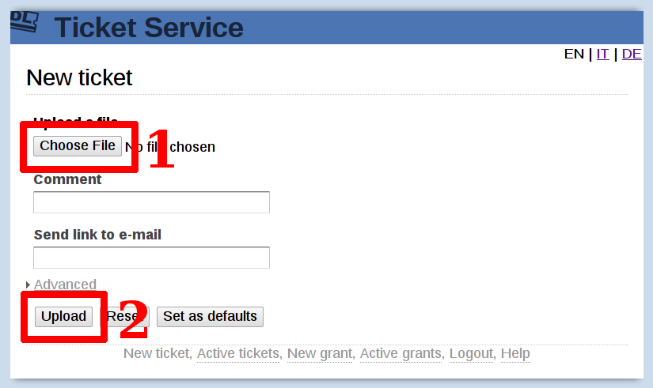
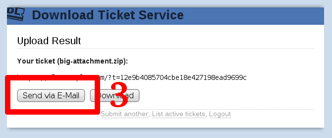
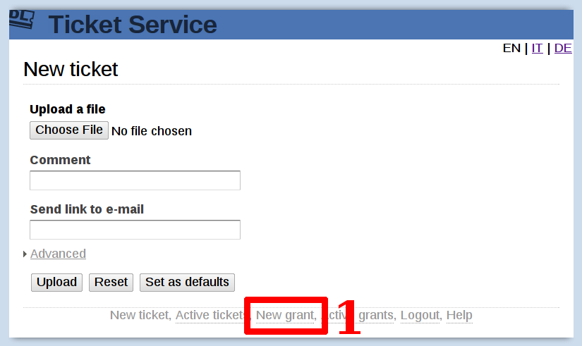
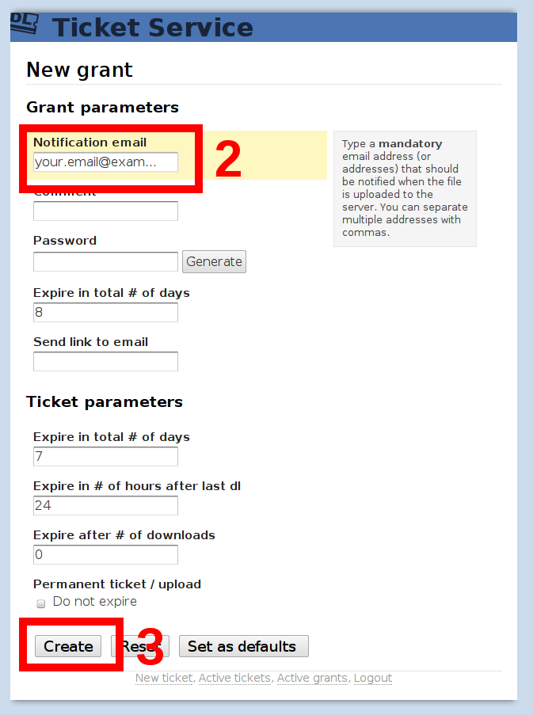
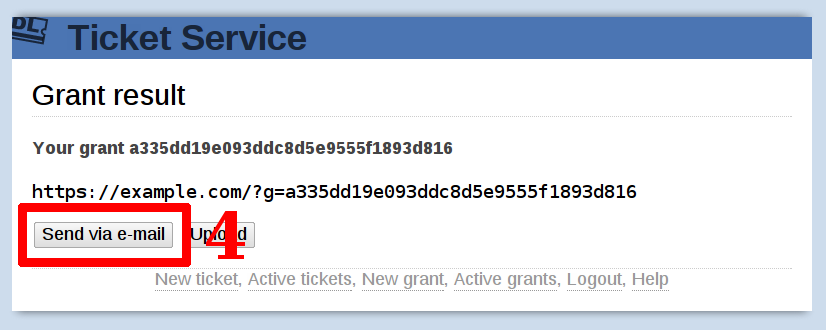
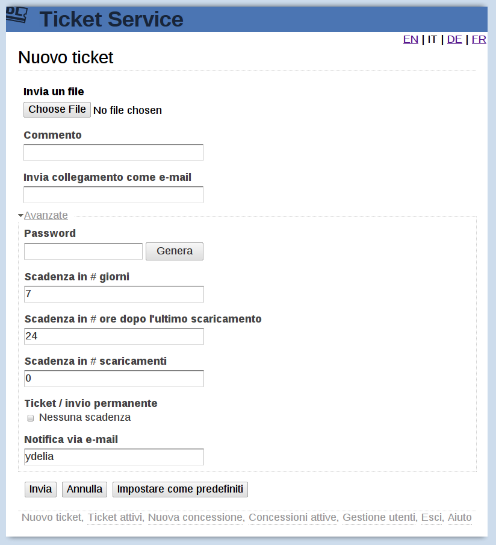

Download ticket service
=======================

.. contents::

Short Step-by-step guide to send attachments
--------------------------------------------

First, go to https://dl.example.com/ and authenticate with your username and
password.

You should be presented with this page:

1) Click on the button under "Upload File" (labelled either "Browse" or "Choose
   File") as outlined in the picture and pick the file you need to send.

2) Click "Upload", and wait until the file is uploaded as shown:

3) Click "Send via E-Mail" to send an e-mail to someone, containing the link
   to the file you just uploaded.

By default, the recipient has one week to download the file before it is
automatically cleaned up. You can change this behavior by setting some
parameters before uploading.

You can see a list of files you have uploaded and manage them by clicking on
the "List active tickets" button, at the bottom of the page.

Short Step-by-step guide to receive attachments
-----------------------------------------------

First, go to https://dl.example.com/ and authenticate with your username and
password.

You should be presented with this page:

1) Click on the "New grant" link at the bottom of the page to start a new
   grant:

2) Enter *your* email address.

3) Click "Create" to generate an upload grant:

4) Click "Send via E-Mail" to send an e-mail to someone, containing the link
   that will allow him to send you any file.

Your recipient simply needs to follow the instructions contained in the link
itself. Once he uploads the file into the server, you will receive an email
containing another link to the file just uploaded.

Advanced upload parameters
--------------------------

Before uploading a file, you can customize how the download and cleanup is
performed by setting some "Advanced" parameters:

* *If you want your file to never be deleted* please check the "Permanent
  ticket" checkbox. Your file will always be available until you manually
  remove it.

* *If you want to be notified every time someone downloads the file* you can
  write your e-mail in the "Get notified by email" box. You'll receive
  notifications every time the file is successfully downloaded or removed from
  the server. This is great if you want extra confirmation that your email has
  been acted upon.

Expire in total # of hours:

  Type the maximal number of hours the uploaded file is allowed to be kept on
  the server. After this period is passed the file will be deleted from the
  server whether is was downloaded or not.

Expire in # of hours after last dl:

  Type the number of hours the uploaded file is allowed to be kept on the
  server after being downloaded. Another download will extend the lifetime of
  the ticket for the specified number of hours. After this period is passed
  without activity, the file is be deleted from the server.

  This feature, when used with a long period (days or weeks), allows "hot"
  tickets to be kept alive only until used, and be deleted automatically
  afterward.

  When used with a short period (24 hours or less), allows to remove the ticket
  as soon as being downloaded, allowing the recipient some margin to download
  the file more than once.

Expire after # of downloads:

  Type the number of times the uploaded file is allowed to be downloaded in
  total. After this amount is reached the file will be deleted from the
  server. Handy if you need to ensure the file is downloaded just once from a
  single person.

If at least one of these parameters expires the file will be deleted. You can
set any parameter to "0" to disable the condition.
