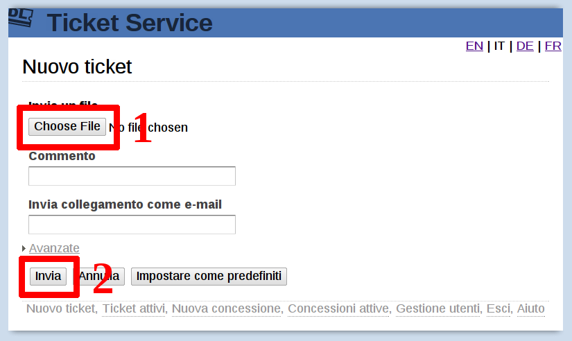
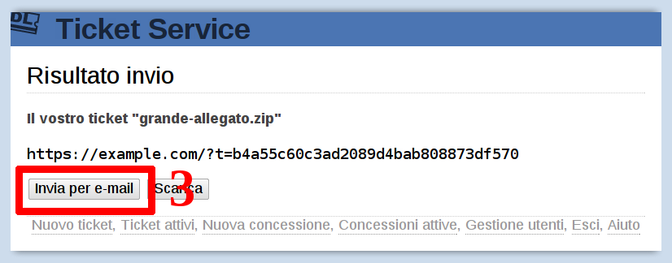
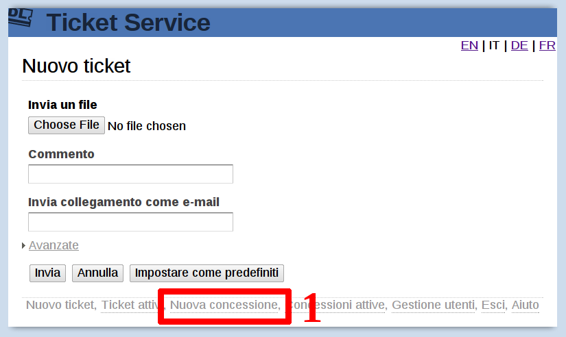
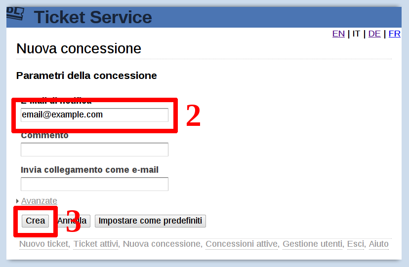
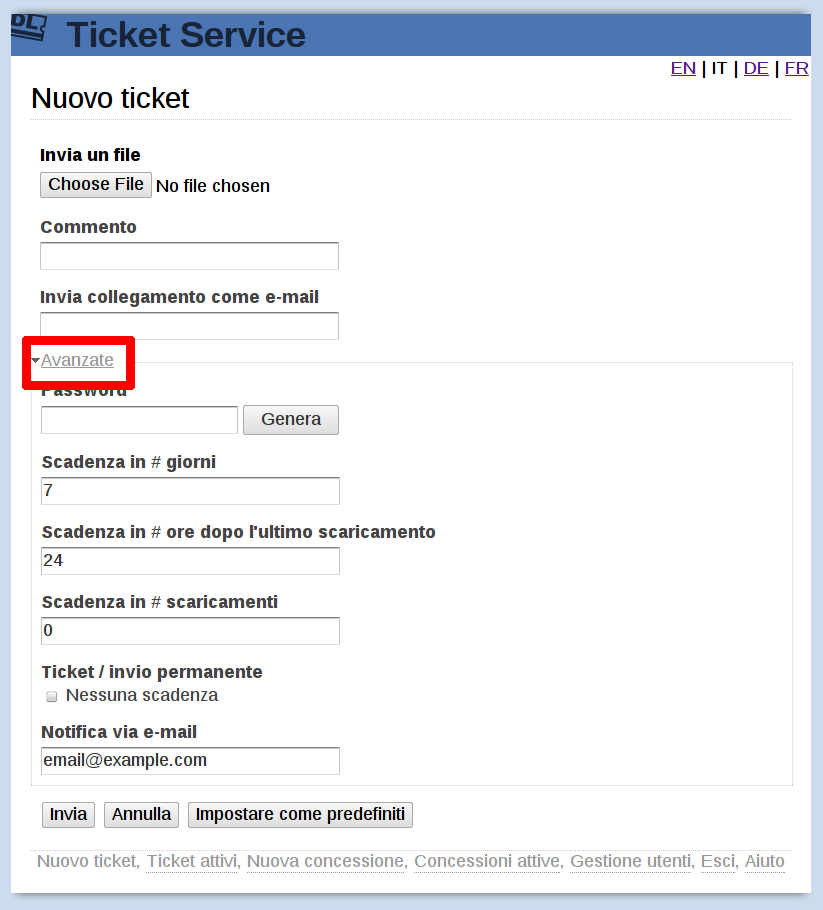

Download ticket service
=======================

.. contents::

Guida rapida passo-passo all'invio degli allegati
-------------------------------------------------

Collegarsi al sito https://dl.example.com/ ed autenticarsi col proprio nome
utente e password.

La schermata iniziale si presenta come segue:

1) Cliccare su "Sfoglia", come indicato nell'immagine e selezionare il file
   desiderato da inviare.

2) Cliccare su "Invia" ed attendere fino al completamento dell'operazione,
   indicata dalla seguente schermata:

3) Cliccare su "Invia per e-mail" per inviare il collegamento al file appena
   caricato via e-mail ad un qualsiasi destinatario usando il proprio programma
   di posta elettronica.

Con le impostazioni predefinite, il destinatario avrà una settimana di tempo
per scaricare il file prima che venga eliminato automaticamente. È possibile
cambiare la scadenza impostando alcuni parametri prima dell'invio del file.

La lista dei file caricati è gestibile cliccando sul collegamento "Ticket
attivi", disponibile in basso alla pagina.

Guida rapida passo-passo alla ricezione degli allegati
------------------------------------------------------

Collegarsi al sito https://dl.example.com/ ed autenticarsi col proprio nome
utente e password.

La schermata iniziale si presenta come segue:

1) Cliccare su "Nuova concessione", in basso alla pagina.

2) Inserire il *proprio* indirizzo e-mail.

3) Cliccare su "Crea" per generare la concessione.

.. image:: g-step-3.png

4) Cliccare su "Invia per email" per inviare la concessione e le istruzioni di
   utilizzo tramite e-mail ad un qualsiasi destinatario.

Il destinatario, una volta ricevuto il collegamento alla concessione, dovrà
semplicemente seguire le indicazioni. Quando il destinatario avrà terminato
l'invio del file, riceverete immediatamente (tramite e-mail) conferma ed un
collegamento al file appena trasferito.

Parametri avanzati
------------------

Prima di procedere all'invio di un file, è possibile impostare la sua
scadenza accedendo ai parametri avanzati:

* *Se desiderate che il file non venga mai eliminato*, abilitare l'opzione
  "Nessuna scadenza", disponibile nel pannello "Avanzate".

* *Se desiderate ricevere notifica per ogni singolo scaricamento*, inserite il
  vostro indirizzo e-mail nella casella "Notifica via e-mail", disponibile nel
  pannello avanzate.

Scadenza in # giorni:

  Inserire il numero massimo di giorni che il file inviato verrà mantenuto nel
  server. Passato il termine, il file viene eliminato automaticamente, sia che
  venga scaricato o meno.

Scadenza in # ore dopo l'ultimo scaricamento:

  Inserire il numero ore che il file inviato verrà mantenuto nel server dopo
  essere stato scaricato. Ogni scaricamento estende il termine del numero di
  ore specificato. Passato il termine, il file viene eliminato automaticamente.

  Questa funzionalità, usata insieme ad un lungo periodo (giorni o settimane),
  permette di mantenere ticket molto utilizzati attivi per un periodo
  indefinito, e rimuoverli automaticamente alla cessazione di utilizzo.

  Usata invece con periodi brevi (24 ore o meno), consente di eliminare il
  ticket rapidamente dopo lo scaricamento, dando al destinatario del margine
  per effettuarne altri.

Scadenza in # scaricamenti

  Inserire il numero di volte che il file può venire scaricato in totale dal
  server. Passato il termine, il file viene eliminato automaticamente.

La scadenza del ticket viene effettuata alla scadenza di uno qualsiasi dei
termini impostati (solitamente del termine che arriva prima). È possibile
impostare un parametro a "0" per disabilitarne il relativo termine.
