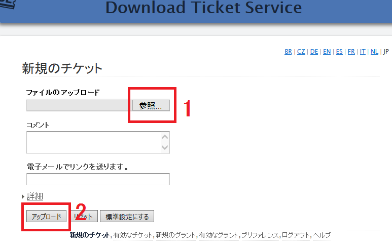
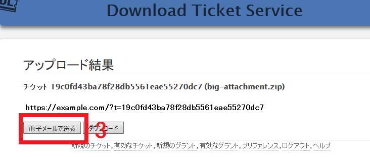
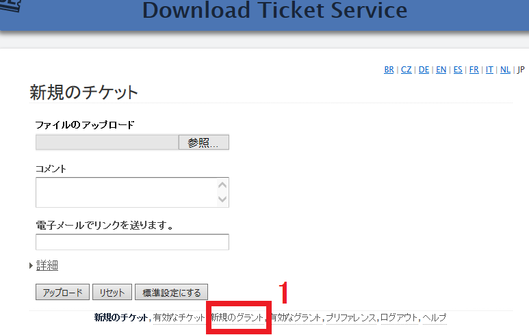
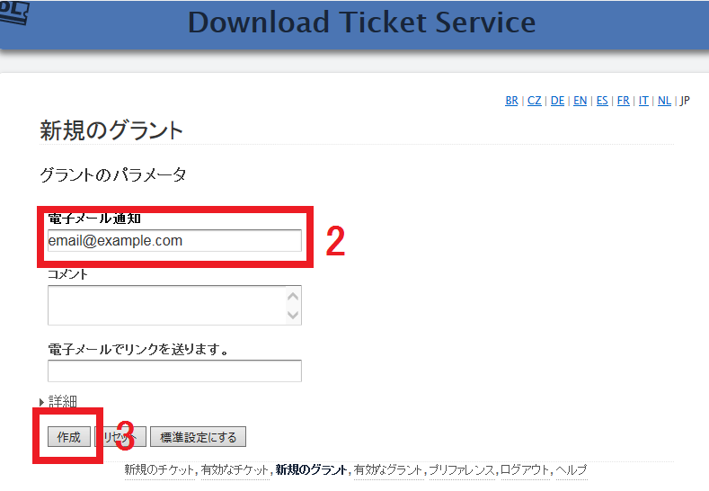
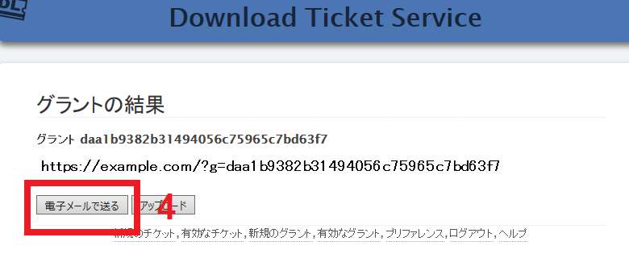
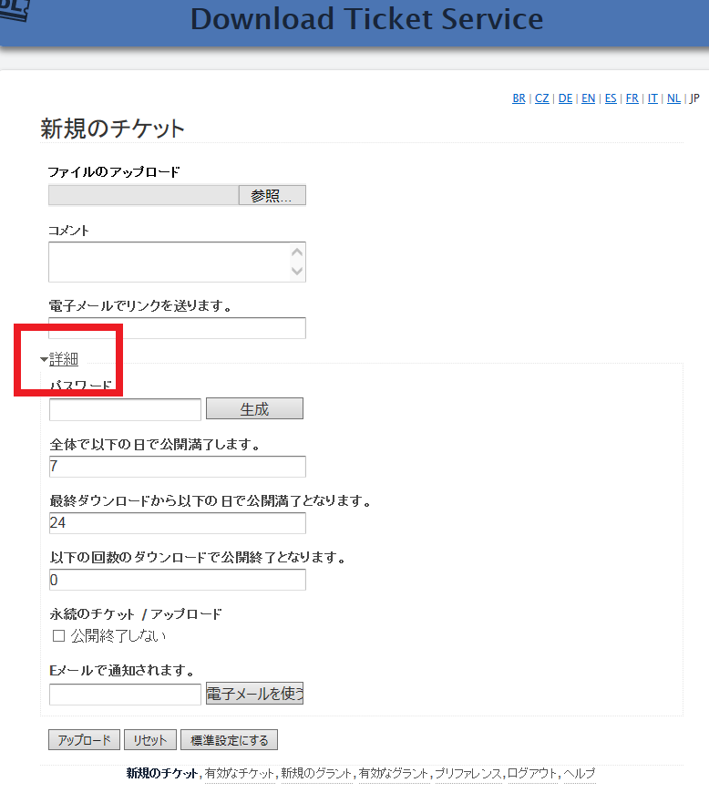

ダウンロードチケットサービス
============================

.. contents::

簡易版　添付送信ガイド
----------------------

はじめに、https://dl.example.com/ をブラウザで開き、ユーザ名とパスワードで認証を行います。

このページになります。:

1) "ファイルのアップロード" ( "ブラウズ" または "参照
..." と書かれている部分) の下のボタンをクリックします。図に書かれているように、送りたいファイルを選択します。

2) "アップロード" をクリックして、図のようにファイルがアップロードが終わるまで待ちます。:

3) "電子メールで送る" をクリックして、今アップロードしたファイルをダウンロードするためのリンクが入ったＥメールを特定の人にメールを送ります。

標準設定では、受け手側は、ファイルが自動的に消される前の1週間以内にファイルのダウンロードを行う必要があります。この動作については、アップロードする前にパラメータを変更することができます。

このページの一番下の "有効なチケット"  ボタンをクリックすることで、アップロードしたファイルリストを見ることができ、それを管理することができます。

簡易版　添付受信ガイド
----------------------

最初に、  https://dl.example.com/ をブラウザで開き、ユーザ名とパスワードで認証を行います。

このページが見えるはずです :

1) このページの一番下の  "新規のグラント" のリンクをクリックすると新しいグラントを作ることができます。:

2)  *あなた自身の* Ｅメールアドレスを入力してください。

3) "作成" をクリックすると、アップロードのグラントが生成されます。:

4) "電子メールで送る" をクリックすると、特定の人がファイルをあなたに送るのを許可するリンクが入ったＥメールをその人に送ります。

受け取った人は、メールのリンクに先に書かれている操作に従う必要があります。受け取った人がファイルをサーバにアップロードした後、あなたに別なリンクが入ったメールが自動的に送られます。

詳細アップロードのパラメーター
------------------------------

"詳細" のパメラーターで、ファイルをアップロードする前に、ダウンロードとその消去の実行がどのようにおこなうかを設定することができます

* *ファイルを自動的に削除したくない場合* "永続のチケット" のチェックボックスにチェックをいれてください。 そのファイルは手動で削除するまでいつでも有効となります。

* *毎回ダウンロードされる毎に通知をうけとりたい場合* "電子メールで通知されます" にあなたのEメールアドレス入力することで受け取ることができます。ファイルのダウンロード、または
サーバからの削除が起きた時ごとに受け取ることができます。
あなたのメールが届いているかどうかの追加の確認が必要な場合は、これは有効な機能です。

全体で以下の日で公開満了します:

  サーバにファイルを保持する最大日数を入力します。この期間が過ぎると、
  ファイルがダウンロードされていても、されていなくても、そのファイルはサーバ
  から削除されます。

最終ダウンロードから以下の日で公開満了になります:

  ダウンロードした後、サーバでアップロードされたファイルを保持する時間を入力してください。
  別なダウンロード操作があればチケットを消すまでの時間が延びます。この期間を何も操作なく超えると、
  ファイルはサーバから削除されます。

  この機能は、長い期間（何日とか、何週間とか）で使う時に使うことができ、使われるまで
  チケットを　"有効" にすることができ、その後で自動的に削除されます。

  短い期間（24時間以内など）で使うときは、ダウンロードされたすぐに、チケットを削除し、
  ファイルを一度以上ダウンロードするための予備時間となります。

以下の回数のダウンロードで公開終了となります:

  アップロードされたファイルのダウンロードされる全体の回数を入力してください。
  この回数になると、ファイルは、サーバから削除されます。
  １人の人から１度ダウンロードされたかどうかを確認するには、便利です。

これらのパラメータの１つで公開解除となると、ファイルは削除されます。いくつかの
パラメターを "0" にすると、条件は満たさなくなります。
