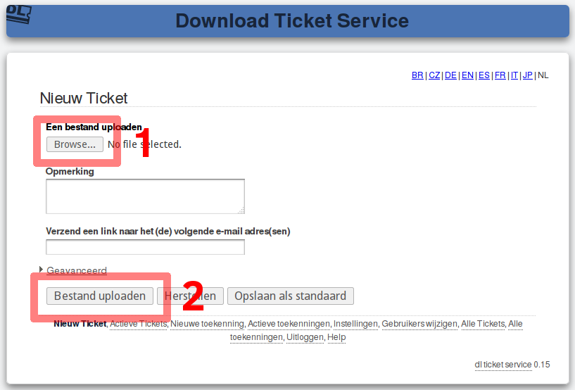
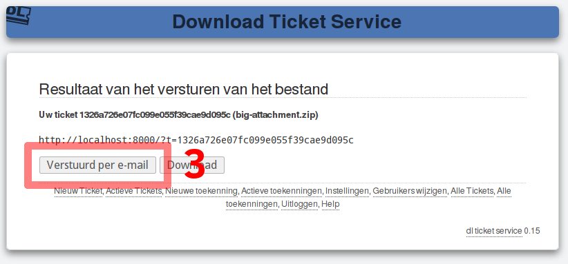
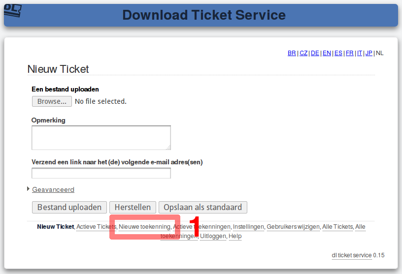
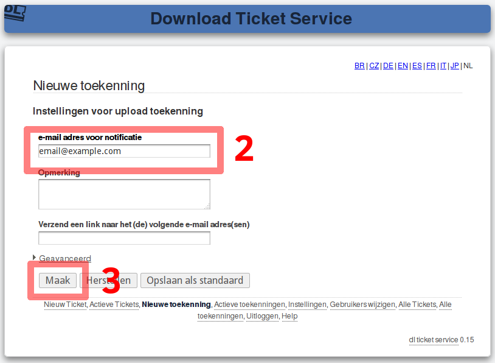
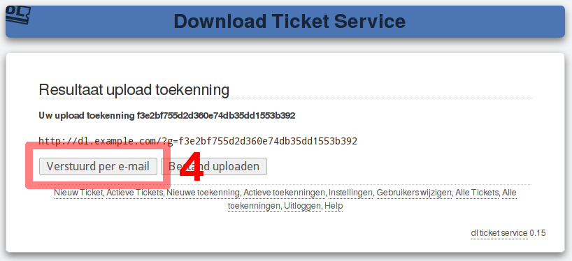
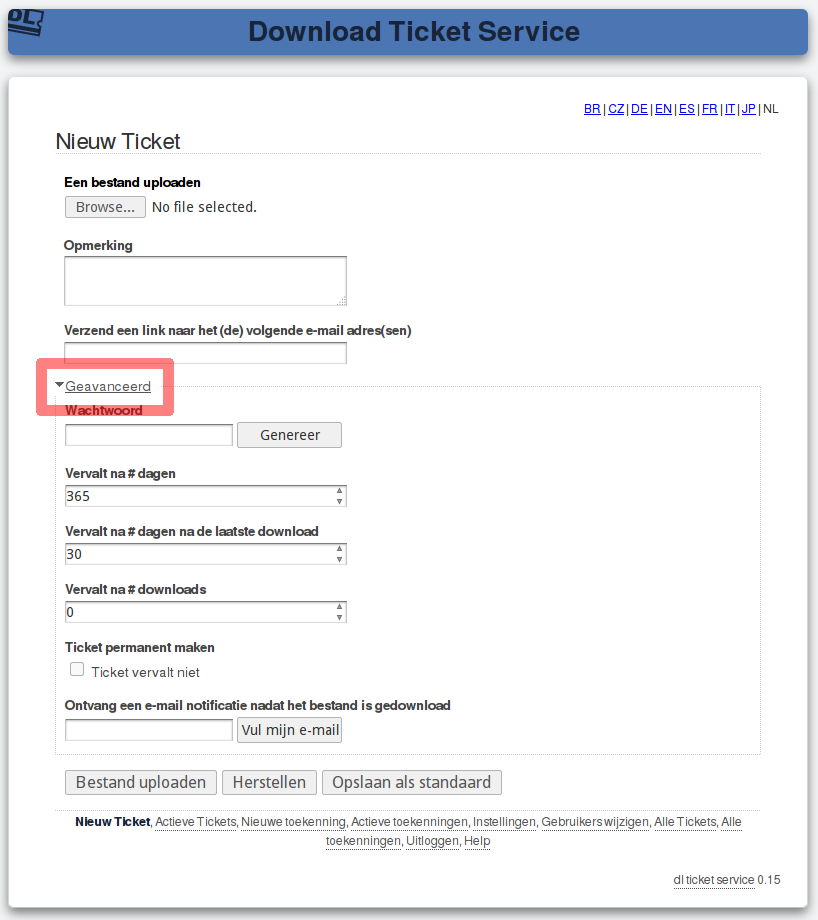

Download ticket service
=======================

.. contents::

Korte stap voor stap handleiding om attachments te versturen
------------------------------------------------------------

Ga alleereerst naar https://dl.example.com/ en log in met uw gebruikersnaam en
wachtwoord.

U ziet nu onderstaande pagina:

1) Klik op de knop "Bestand kiezen" (of "Browse") onder "Een bestand uploaden"
   zoals aangegeven op bovenstaand figuur. Selecteer vervolgens het bestand
   dat u wilt versturen.

2) Klik op "Bestand uploaden" en wacht totdat het bestand is geüpload. Als het
   uploaden is gelukt verschijnt de volgende figuur:

3) Klik "Verstuurd per e-mail" om de e-mail naar de gewenste persoon te
   versturen. Deze mail bevat de link naar het bestand dat u zojuist heeft
   geüpload.

Standaard heeft de ontvanger één week de tijd om het bestand te downloaden
voordat dit bestand automatisch verwijderd wordt. U kunt dit gedrag wijzigen
door een aantal parameters in te stellen voordat u het bestand upload.

U kunt een lijst van bestanden die u heeft geüpload zien en wijzigen door op
"Actieve tickets" onderaan de pagina te klikken.

Korte stap voor stap handleiding om attachments te ontvangen
------------------------------------------------------------

Ga alleereerst naar https://dl.example.com/ en log in met uw gebruikersnaam en
wachtwoord.

U ziet nu onderstaande pagina:

1) Klik op de "Nieuwe toekenning" link onderaan de pagina om een nieuwe
   toekenning te maken.

2) Vul uw eigen e-mail adres in.

3) Klik op "Maak" om een upload toekenning te maken.

4) Klik op "Verstuurd per e-mail" om een e-mail naar iemand te versturen. Deze
   e-mail bevat een link die het de ontvanger mogelijk maakt om u een groot
   bestand terug te sturen.

Uw ontvanger hoeft alleen maar de instructies te volgen zoals aangegeven in de
mail. Als de ontvanger van de link zijn bestand heeft geüpload naar de server
ontvangt u een notificatie e-mail met daarin een link naar het geüploade
bestand.

Geavanceerde upload parameters
------------------------------

Voordat u een bestand upload kunt u met geavancceerde parameters instellen hoe
vaak het bestand gedownload kan worden en of en wanneer het bestand automatisch
wordt verwijderd.

* *Als u niet wilt dat uw bestand ooit automatisch wordt verwijderd* zet dan
  een vinkje bij "Ticket permanent maken". Uw bestand zal altijd beschikbaar
  blijven totdat u het bestand zelf handmatig verwijderd.
* *Als u iedere keer als iemand uw bestand download een melding wilt ontvangen*
  vul dan uw e-mail adres in bij "Ontvang een e-mail notificatie nadat het
  bestand is gedownload". U ontvangt nu iedere keer een melding als uw bestand
  succesvol is gedownload of wanneer het automatisch van de server is
  verwijderd. Deze functie is erg handig als u er zeker van wilt zijn dat men
  gereageerd heeft op de door u verstuurde e-mail.

Vervalt na # dagen:

  Vul hier het maximaal aantal dagen in dat een geüpload bestand op de server
  blijft staan. Na deze periode wordt het bestand automatisch van de server
  verwijderd. Het maakt hierbij niet uit of het bestand wel of niet
  gedownload was tijdens het ingestelde tijdsinterval.

Vervalt na # dagen na de laatste download:

  Vul hier het maximaal aantal dagen in dat een geüpload bestand op de server
  blijft staan nadat het gedownload is. Een volgende download zorgt ervoor
  dat de teller weer wordt gereset. Nadat het ingestelde aantal dagen is
  verstreken zonder dat er een download van het bestand heeft plaatsgevonden,
  zal het bestand automatisch van de server verwijderd worden.

  Deze functie zorgt ervoor dat populaire bestanden bewaard blijven maar
  nadat deze is gezakt automatisch verwijderd worden. Het is aan
  te raden om het tijdsinterval in te stellen op meerdere dagen of weken.

  Zorg er altijd voor dat u het tijdsinterval zodanig instelt dat een
  ontvanger van uw e-mail het bestand indien nodig twee keer kan downloaden.

Vervalt na # downloads:

  Vul het aantal keer in dat het geüploade bestand gedownload kan worden. Als
  het ingestelde aantal downloads bereikt is zal het bestand automatisch van
  de server verwijderd worden. Deze functie is handig als u er bijvoorbeeld
  zeker van wilt zijn dat uw bestand één keer gedownload wordt door één
  persoon.

Als één van bovenstaande ingestelde parameters verloopt dan zal het bestand
verwijderd worden. Als u "0" invult bij een parameter dan zal deze
uitgeschakeld worden.
