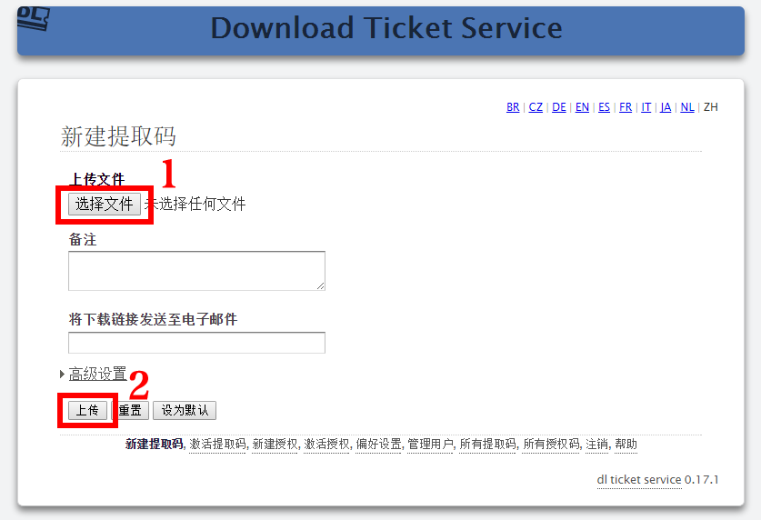
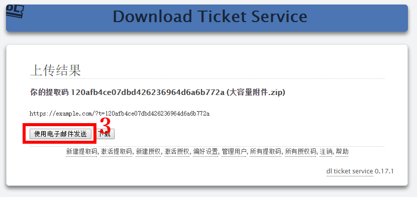
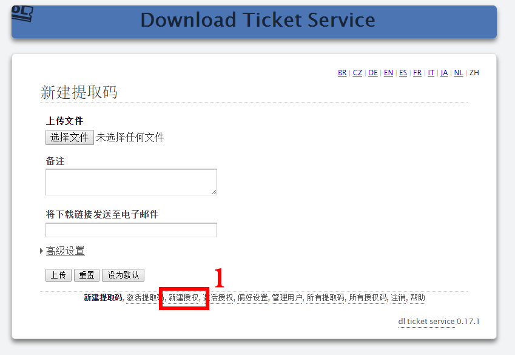
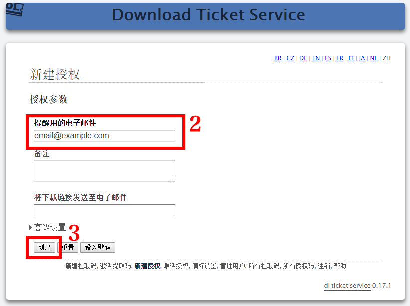
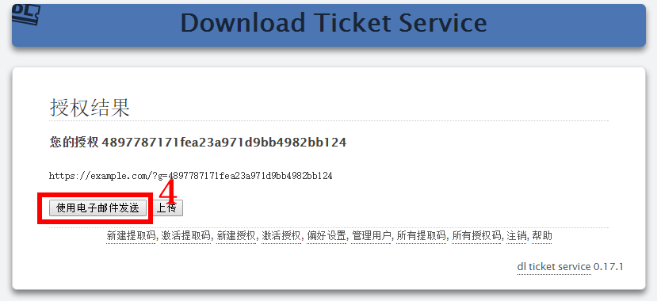
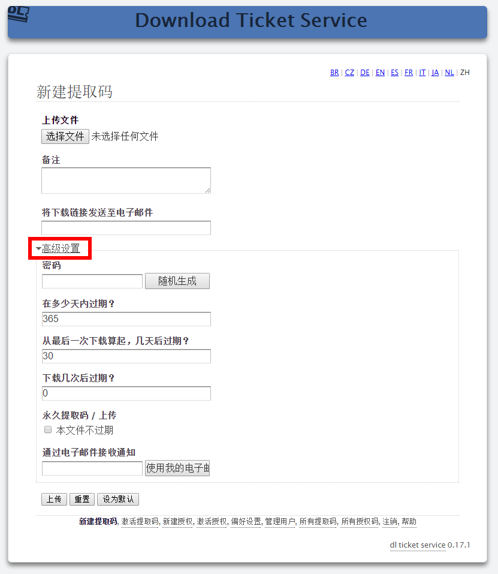

鉴权下载服务系统
=======================

.. contents::

简明步骤：上传附件
--------------------------------------------

首先，访问 https://dl.example.com/ 并使用正确的用户名、密码完成登陆认证。

如果一切正常，你应该可以看到和下图类似的页面：

1) 如上图框线所示，单击“上传文件”下方的按钮（按钮上一般会显示“选择文件”或者是“浏览”字样），选择需要上传的文件。

2) 单击“上传”，然后等待，直至文件上传成功，如下图所示：

3) 单击“使用电子邮件发送”，可以给对方发送邮件，邮件中会包含你刚刚上传文件的地址。

默认情况下，文件接收人有一周的时间下载这个文件，超时后，该文件将被自动清除。要变更这一设置，可在上传前设置对应的参数。

你可通过点击页面底部的“所有提取码”链接来查看、管理的所有上传的文件。

简明步骤：接收（他人上传）附件
-----------------------------------------------

首先，访问 https://dl.example.com/ 并使用正确的用户名、密码完成登陆认证。

你应该可以看到和下图类似的页面：

1) 单击页面底部的“新建授权”链接，来新建单次上传文件授权：

2) 输入 *你的* 电子邮件地址。

3) 单击“创建”，即可生成新的文件上传授权。

4) 单击“使用电子邮件发送”，可以向对方发送邮件，邮件中会包含一个链接，使用该链接，对方可以上传任意文件。

邮件接收者只需要按照链接的指示，完成对应的上传动作，即可上传文件。文件上传到服务器后，你将立刻收到邮件提醒，该邮件中将包含对应已上传文件的文件地址。

高级上传参数
--------------------------

上传文件前，你可通过“高级设置”中的参数定义服务器的文件下载、清除行为：

* *如果你需要服务器永远不删除一个文件* 请勾选“本文件不过期”选项。该文件将永远可用，直到您从服务器上将其手动删除。

* *如果你希望每次有人下载文件后都收到通知* 可在“通过电子邮件接收通知”文本框内输入你的电子邮件地址。这样一来，你将在每次该文件被下载、或是从服务器被删除后收到邮件通知。该功能在您需要确认电子邮箱是否正常工作时十分有用。

在指定天数后过期：

  在“在多少天内过期？”文本框处输入数字，系统将以该数字作为保留该文件的最长期限。超过该期限后，该文件无论是否被下载过，都将被删除。

从最后一次下载算起，在指定天数后过期：

  在“从最后一次下载算起，几天后过期？”文本框中输入数字，在文件被下载后，系统将以该数字作为保留该文件的最长期限。如果期间有他人再次下载文件，则该文件的保留期限将按照对应有效天数被适当延长。如果保留期限内内无人再下载此文件，该文件将被清除。

  该功能在用于长期保存（几天、几周）的文件时，可以让高人气的提取码在被使用时一直保持激活状态，并在无人使用后，被马上删除。

  在用于短期保存（小于一天/24小时）的文件时，该功能可以让文件在下载后立即消失，但同时也给收件人提供了一定缓冲时间，来多次下载文件。

在下载指定次数后过期：

  在“下载几次后过期？”文本框中输入数字，系统将以该数字作为对应文件能被下载的最多次数。在文件下载次数达到这个数字后，文件将从服务器上清除。如果您只想让一个人下载该文件，且只下载一次，该功能非常方便。

  这些设置参数是并列的，任何一个参数过期，都会导致文件清除。如果您想禁用这些设置，请在对应参数中输入“0”。
